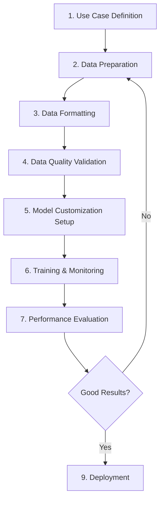

# Fine-Tuning Best Practices for TheoAgent
## Based on AWS Bedrock Claude 3 Haiku Fine-Tuning Guide

> **Source:** [AWS Best Practices for Fine-Tuning Anthropic's Claude 3 Haiku](https://aws.amazon.com/blogs/machine-learning/best-practices-and-lessons-for-fine-tuning-anthropics-claude-3-haiku-on-amazon-bedrock/)

---

## 1. Use Case Definition & Suitability Assessment

### ✅ Recommended Use Cases for Fine-Tuning TheoAgent:

**HIGH SUCCESS LIKELIHOOD:**
- **Specific Tone/Format**: Teaching TheoAgent to respond in a specific Catholic theological style (e.g., Thomistic, patristic, pastoral)
- **Structured Outputs**: Generating responses in consistent JSON schemas for scripture references, citations, or teaching frameworks
- **Tool/API Usage**: Teaching TheoAgent to effectively use custom tools for Vatican document retrieval, liturgical calendar lookup, etc.
- **Particular Language**: Ensuring theologically precise language specific to Catholic doctrine

**MEDIUM SUCCESS LIKELIHOOD:**
- **New Skills**: Teaching specific theological reasoning patterns (e.g., moral case analysis, scriptural exegesis methods)
- **Classification**: Categorizing theological questions by type (doctrinal, moral, liturgical, scriptural)

**LOW SUCCESS LIKELIHOOD (Use RAG Instead):**
- **Teaching New Knowledge**: Adding new Church documents, papal teachings, or theological facts
  - ❌ Fine-tuning won't reliably teach new factual content
  - ✅ Use RAG (Retrieval Augmented Generation) instead

### Fine-Tuning vs. RAG Decision Matrix

| Problem Type | Example | Best Approach |
|-------------|---------|---------------|
| **Format/Tone Consistency** | Respond in scholarly Catholic style with specific citation format | **Fine-Tuning** |
| **New Factual Knowledge** | Latest papal encyclicals, new canonizations | **RAG** |
| **Specific Skills** | Moral reasoning framework application | **Fine-Tuning** |
| **Domain Terminology** | Using precise theological terms correctly | **Fine-Tuning + RAG** |
| **Historical Facts** | Church history dates, council decisions | **RAG** |
| **Response Structure** | Always include scripture, CCC, and magisterium citations | **Fine-Tuning** |

---

## 2. LLM Fine-Tuning Lifecycle

### Complete Process Overview:



### Stage Breakdown:

1. **Use Case Definition** (1-2 days)
   - Define specific task or knowledge domain
   - Set success metrics (accuracy, F1 score, consistency)
   - Determine if fine-tuning is appropriate

2. **Data Preparation** (1-2 weeks)
   - Gather high-quality theological Q&A examples
   - Clean and validate data
   - Ensure theological accuracy

3. **Data Formatting** (2-3 days)
   - Structure data in JSONL format
   - Add system prompts
   - Use XML tags for structured content

4. **Data Quality Validation** (3-5 days)
   - Human expert review (SMEs - theologians, catechists)
   - LLM-as-judge validation (using Claude 3.5 Sonnet)

5. **Model Customization** (1 day)
   - Configure hyperparameters
   - Set learning rate, batch size, epochs

6. **Training & Monitoring** (hours to days)
   - Run training job
   - Monitor progress
   - Enable early stopping

7. **Performance Evaluation** (2-3 days)
   - Test against baseline
   - Measure improvements
   - Compare with base models

8. **Iteration** (ongoing)
   - Refine based on results
   - Add more training data
   - Adjust hyperparameters

9. **Deployment** (1 day)
   - Deploy fine-tuned model
   - Monitor production performance

---

## 3. Data Preparation - CRITICAL SUCCESS FACTOR

### 🎯 Key Principle: **QUALITY > QUANTITY**

> "High-quality datasets, even if smaller in size, yield better results than larger but less refined ones."

### Data Quality Requirements:

#### ✅ High-Quality Training Example:
```jsonl
{
  "system": "You are TheoAgent, a Catholic theological expert. Provide accurate, precise answers based on Catholic teaching. Always cite sources using the format [Source: Document Name, Paragraph].",
  "messages": [
    {
      "role": "user",
      "content": "<question>What does the Catholic Church teach about the relationship between faith and reason?</question>\n<context>The user is asking about fundamental Catholic epistemology.</context>"
    },
    {
      "role": "assistant",
      "content": "The Catholic Church teaches that faith and reason are complementary, not contradictory. Faith perfects reason, and reason illuminates faith.\n\n<key_points>\n1. Faith and reason are both gifts from God\n2. They cannot truly contradict each other\n3. Faith goes beyond reason but does not oppose it\n</key_points>\n\n<sources>\n[Source: Catechism of the Catholic Church, 159] \"Faith and science: Though faith is above reason, there can never be any real discrepancy between faith and reason.\"\n[Source: Fides et Ratio, 1] \"Faith and reason are like two wings on which the human spirit rises to the contemplation of truth.\"\n</sources>\n\n<practical_application>\nThis teaching encourages Catholics to pursue both theological study and scientific inquiry, seeing them as mutually enriching rather than opposing.\n</practical_application>"
    }
  ]
}
```

#### ❌ Poor-Quality Training Example:
```jsonl
{
  "messages": [
    {
      "role": "user",
      "content": "faith and reason?"
    },
    {
      "role": "assistant",
      "content": "They work together. The Church says they're both important."
    }
  ]
}
```

### Data Cleaning & Validation Methods:

#### Method 1: Human Expert Review (SME)
- **Best for**: Theological accuracy, doctrinal precision
- **Process**:
  1. Recruit Catholic theologians, catechists, or educated laity
  2. Review each Q&A pair for:
     - Doctrinal accuracy
     - Clarity and completeness
     - Proper citation format
     - Appropriate tone
  3. Rate quality: Excellent / Good / Needs Revision / Reject
  4. Only include Excellent/Good examples in training set

#### Method 2: LLM-as-Judge (Scalable)
- **Best for**: Large datasets, consistency checks
- **Process**: Use Claude 3.5 Sonnet to validate training data

```python
# Example validation prompt for Claude 3.5 Sonnet
validation_prompt = """
You are a theological expert evaluating training data quality for a Catholic AI assistant.

Evaluate this Q&A pair on:
1. Theological Accuracy (Does it align with Catholic doctrine?)
2. Completeness (Is the answer thorough?)
3. Citation Quality (Are sources properly cited?)
4. Clarity (Is it well-written?)
5. Tone (Is it appropriately pastoral/scholarly?)

<question>
{user_question}
</question>

<answer>
{assistant_answer}
</answer>

<context>
{relevant_church_documents}
</context>

Provide:
1. A brief assessment (2-3 sentences)
2. A quality score: EXCELLENT / GOOD / FAIR / POOR
3. Specific issues (if any)

Format:
<assessment>Your assessment here</assessment>
<score>EXCELLENT/GOOD/FAIR/POOR</score>
<issues>List any problems</issues>
"""
```

### Data Formatting Best Practices:

#### 1. Always Include System Prompts
```jsonl
{
  "system": "You are TheoAgent, a Catholic theological assistant. Provide accurate answers based on Catholic teaching from Scripture, Tradition, and Magisterium. Always cite sources.",
  "messages": [...]
}
```

#### 2. Use XML Tags for Structure
```xml
<question>User's question here</question>
<context>Relevant context about the question</context>
<answer>
  <summary>Brief answer</summary>
  <detailed_explanation>
    In-depth theological explanation
  </detailed_explanation>
  <citations>
    [CCC 1234], [Vatican II, Dei Verbum 5]
  </citations>
</answer>
```

#### 3. Include Reasoning Steps (Chain-of-Thought)
```jsonl
{
  "role": "assistant",
  "content": "<reasoning>\n1. The question asks about the Immaculate Conception\n2. This is distinct from the virgin birth\n3. Key sources: Ineffabilis Deus (1854)\n4. Must clarify common misconceptions\n</reasoning>\n\n<answer>\nThe Immaculate Conception refers to Mary being conceived without original sin...\n</answer>"
}
```

---

## 4. Dataset Size Recommendations

### Minimum Dataset Sizes by Use Case:

| Task Type | Minimum Examples | Recommended Examples | Excellent Results |
|-----------|------------------|----------------------|-------------------|
| **Classification** | 500 | 1,000-3,000 | 5,000-10,000 |
| **Structured Outputs** | 300 | 1,000-2,000 | 3,000-5,000 |
| **Tone/Style** | 200 | 500-1,000 | 2,000-3,000 |
| **Tool Usage** | 300 | 500-1,500 | 2,000-3,000 |
| **Complex Reasoning** | 1,000 | 3,000-5,000 | 10,000+ |

### For TheoAgent Specifically:

**Starting Point**: 500-1,000 high-quality theological Q&A pairs
- Cover diverse topics: doctrine, morality, scripture, liturgy
- Include various question types: factual, analytical, pastoral
- Ensure accurate citations and sources

**Growth Path**:
- Phase 1: 500 examples (basic theological responses)
- Phase 2: 1,500 examples (add moral theology, scripture exegesis)
- Phase 3: 3,000+ examples (comprehensive coverage)

---

## 5. Hyperparameter Optimization

### Key Hyperparameters:

#### Learning Rate Multiplier
- **Range**: 0.1 - 2.0
- **Default**: 1.0
- **Recommendation**: Start with 1.0, adjust based on evaluation
- **Higher values**: Faster learning, risk of instability
- **Lower values**: More stable, slower convergence

#### Batch Size
- **Range**: 4 - 256
- **Default**: 32
- **Recommendations by Dataset Size**:
  - **< 500 examples**: Batch size 4-16
  - **500-1,000 examples**: Batch size 16-32
  - **1,000+ examples**: Batch size 32-64

#### Epochs
- **Definition**: One pass through entire dataset
- **Range**: 1-20 (typically)
- **Recommendations**:
  - **Small datasets (< 500)**: 5-10 epochs
  - **Medium datasets (500-2,000)**: 3-5 epochs
  - **Large datasets (2,000+)**: 1-3 epochs

### Optimal Settings by Dataset Size:

| Dataset Size | Learning Rate Multiplier | Batch Size | Epochs |
|--------------|-------------------------|------------|---------|
| 100 examples | 0.5-1.0 | 4-8 | 8-12 |
| 500 examples | 0.8-1.2 | 16-24 | 5-8 |
| 1,000 examples | 1.0-1.5 | 24-32 | 3-5 |
| 3,000 examples | 1.2-1.8 | 32-48 | 2-4 |
| 10,000 examples | 1.5-2.0 | 48-64 | 1-3 |

### Early Stopping
- **Purpose**: Prevent overfitting
- **How**: Monitor validation loss, stop when it stops improving
- **Enable**: Always recommended for fine-tuning

---

## 6. Performance Evaluation Metrics

### Primary Metric: F1 Score

**Formula:**
```
Precision = Matching tokens / Total generated tokens
Recall = Matching tokens / Total reference tokens
F1 Score = 2 × (Precision × Recall) / (Precision + Recall) × 100
```

**Interpretation:**
- **90-100%**: Excellent performance
- **80-89%**: Good performance
- **70-79%**: Acceptable performance
- **< 70%**: Needs improvement

### Additional Metrics for TheoAgent:

1. **Theological Accuracy** (Human Expert Review)
   - Doctrinal correctness
   - Proper interpretation of sources
   - Scale: 1-5 stars

2. **Citation Quality**
   - Proper source attribution
   - Accurate references
   - Appropriate source selection

3. **Tone Consistency**
   - Pastoral vs. scholarly appropriateness
   - Respectful and charitable

4. **Token Efficiency**
   - Fine-tuned models typically reduce token usage by 30-40%
   - More concise, precise answers
   - Lower costs in production

### Baseline Comparison:

Test fine-tuned model against:
1. **Base Claude 3 Haiku**: Expect 15-25% improvement
2. **Base Claude 3 Sonnet**: Expect 10-20% improvement
3. **Base Claude 3.5 Sonnet**: Expect 5-10% improvement

**Key Finding**: A well-fine-tuned Haiku can outperform larger base models!

---

## 7. Training Data Format Specification

### JSONL Format (Required for AWS Bedrock):

Each line is a complete JSON object representing one training example:

```jsonl
{"system": "System prompt here", "messages": [{"role": "user", "content": "Question"}, {"role": "assistant", "content": "Answer"}]}
{"system": "System prompt here", "messages": [{"role": "user", "content": "Question"}, {"role": "assistant", "content": "Answer"}]}
```

### Complete Example for TheoAgent:

```jsonl
{"system": "You are TheoAgent, a Catholic theological assistant. Provide accurate, well-sourced answers based on Sacred Scripture, Sacred Tradition, and the Magisterium. Always cite specific sources.", "messages": [{"role": "user", "content": "<question>What is transubstantiation?</question><context>User is asking about Eucharistic theology</context>"}, {"role": "assistant", "content": "<answer>\n<summary>Transubstantiation is the Catholic teaching that the bread and wine become the actual Body and Blood of Christ during the Eucharist, while retaining the appearance of bread and wine.</summary>\n\n<explanation>\nThe term 'transubstantiation' describes the change of substance (not appearance) that occurs at the consecration during Mass. The accidents (appearance, taste, smell) of bread and wine remain, but the substance becomes Christ's Body and Blood.\n\nThis teaching was formally defined at the Council of Trent (1551) and reaffirmed at Vatican II.\n</explanation>\n\n<citations>\n[Source: CCC 1376] \"The Council of Trent summarizes the Catholic faith by declaring: 'Because Christ our Redeemer said that it was truly his body that he was offering under the species of bread, it has always been the conviction of the Church of God... that by the consecration of the bread and wine there takes place a change of the whole substance of the bread into the substance of the body of Christ our Lord and of the whole substance of the wine into the substance of his blood.'\"\n\n[Source: CCC 1413] \"By the consecration the transubstantiation of the bread and wine into the Body and Blood of Christ is brought about.\"\n</citations>\n</answer>"}]}
{"system": "You are TheoAgent, a Catholic theological assistant. Provide accurate, well-sourced answers based on Sacred Scripture, Sacred Tradition, and the Magisterium. Always cite specific sources.", "messages": [{"role": "user", "content": "<question>How should Catholics approach questions about the historicity of Genesis?</question><context>User is concerned about faith and science</context>"}, {"role": "assistant", "content": "<answer>\n<summary>The Catholic Church teaches that Genesis conveys religious truths about God as Creator and human nature, but should not be read as a scientific textbook. It uses ancient literary forms to communicate theological truth.</summary>\n\n<explanation>\n<key_principle>The Church distinguishes between the religious truths Genesis teaches and the literary form used to communicate them.</key_principle>\n\n<church_teaching>\n1. Genesis teaches true religious doctrine: God created all things, humans are made in God's image, sin entered through human choice\n2. The text uses ancient Near Eastern literary forms (not modern scientific description)\n3. Catholics are free to accept evolutionary science while affirming God as Creator\n4. The literal-historical interpretation is not required by the Church\n</church_teaching>\n</explanation>\n\n<citations>\n[Source: CCC 337] \"God himself created the visible world in all its richness, diversity and order. Scripture presents the work of the Creator symbolically as a succession of six days of divine 'work', concluded by the 'rest' of the seventh day.\"\n\n[Source: Pius XII, Humani Generis, 36] \"The Teaching Authority of the Church does not forbid that... research and discussions, on the part of men experienced in both fields, take place with regard to the doctrine of evolution.\"\n\n[Source: Dei Verbum, 11] \"Since everything asserted by the inspired authors or sacred writers must be held to be asserted by the Holy Spirit... the books of Scripture must be acknowledged as teaching solidly, faithfully and without error that truth which God wanted put into sacred writings for the sake of salvation.\"\n</citations>\n\n<practical_guidance>\nCatholics can:\n- Accept scientific findings about evolution and the age of the earth\n- Read Genesis as theological rather than scientific literature\n- Affirm both divine creation and natural processes\n- See no conflict between faith and properly understood science\n</practical_guidance>\n</answer>"}]}
```

### Data File Structure:

```
training_data/
├── doctrinal_theology.jsonl (500 examples)
├── moral_theology.jsonl (300 examples)
├── scripture_exegesis.jsonl (400 examples)
├── liturgy_sacraments.jsonl (300 examples)
└── church_history.jsonl (200 examples)
```

---

## 8. Prompt Engineering for Training Data

### Template Structure:

```xml
<system_prompt>
You are TheoAgent, a Catholic theological assistant.

Core Competencies:
- Sacred Scripture interpretation (using literal, allegorical, moral, anagogical senses)
- Catechism of the Catholic Church expertise
- Familiarity with papal encyclicals and Church documents
- Moral theology and ethical reasoning

Response Guidelines:
1. Always cite specific sources with paragraph numbers
2. Distinguish between definitive teachings and theological opinions
3. Provide pastoral sensitivity for difficult topics
4. Use clear, accessible language while maintaining theological precision
5. Include practical applications when appropriate

Citation Format:
[Source: Document Name, Paragraph/Section Number]
Examples: [CCC 1234], [Lumen Gentium 16], [John Paul II, Veritatis Splendor 55]
</system_prompt>

<user_message>
<question>{user_question}</question>
<context>{any_relevant_context}</context>
</user_message>

<assistant_message>
<answer>
  <summary>{brief_direct_answer}</summary>
  
  <explanation>
    {detailed_theological_explanation}
  </explanation>
  
  <citations>
    {properly_formatted_source_citations}
  </citations>
  
  <practical_application>
    {how_this_applies_to_life}
  </practical_application>
</answer>
</assistant_message>
```

---

## 9. Implementation Steps for TheoAgent

### Phase 1: Data Collection (Week 1-2)

**Goal**: Collect 500 high-quality Q&A pairs

**Sources**:
1. **Catholic Answers Forum**: Mine answered questions
2. **Ask a Priest Websites**: Real pastoral questions
3. **Theology Textbook Q&A Sections**
4. **CCC Study Guides**
5. **Your own expertise**: Create Q&A pairs

**Distribution**:
- Doctrine: 150 examples
- Morality: 120 examples
- Scripture: 100 examples
- Liturgy/Sacraments: 80 examples
- Prayer/Spirituality: 50 examples

### Phase 2: Data Cleaning & Validation (Week 3)

1. **Theological Review**:
   - Check all answers against CCC, Vatican documents
   - Verify scriptural citations
   - Ensure doctrinal accuracy

2. **Format Standardization**:
   - Convert to JSONL format
   - Add XML structure tags
   - Include system prompts
   - Add proper citations

3. **Quality Filtering**:
   - Remove incomplete answers
   - Eliminate theological errors
   - Ensure citation quality
   - Target: 400-450 high-quality examples from original 500

### Phase 3: LLM-as-Judge Validation (Week 4)

Use Claude 3.5 Sonnet to validate all training data:

```python
import anthropic
import json

client = anthropic.Anthropic(api_key="your_key")

def validate_training_example(example):
    validation_prompt = f"""
    Evaluate this theological Q&A pair for training data quality.
    
    Question: {example['messages'][0]['content']}
    Answer: {example['messages'][1]['content']}
    
    Check for:
    1. Theological accuracy (aligns with Catholic doctrine?)
    2. Citation quality (proper sources?)
    3. Completeness
    4. Clarity
    
    Respond with:
    <score>EXCELLENT/GOOD/FAIR/POOR</score>
    <reasoning>Brief explanation</reasoning>
    <issues>Any problems found</issues>
    """
    
    response = client.messages.create(
        model="claude-3-5-sonnet-20241022",
        max_tokens=1000,
        messages=[{"role": "user", "content": validation_prompt}]
    )
    
    return response.content[0].text

# Validate all examples, keep only EXCELLENT and GOOD
```

### Phase 4: Fine-Tuning Configuration (Day 1)

**Initial Hyperparameters** (for ~400 examples):
- Learning Rate Multiplier: 1.0
- Batch Size: 16
- Epochs: 5-7
- Early Stopping: Enabled

### Phase 5: Training (Hours to 1 day)

Submit fine-tuning job to AWS Bedrock:

```python
import boto3

bedrock = boto3.client('bedrock')

response = bedrock.create_model_customization_job(
    customizationType='FINE_TUNING',
    baseModelIdentifier='anthropic.claude-3-haiku-20240307-v1:0',
    jobName='theoagent-v1-doctrinal',
    customModelName='theoagent-claude-haiku-v1',
    roleArn='your-iam-role-arn',
    trainingDataConfig={
        's3Uri': 's3://your-bucket/training-data/combined.jsonl'
    },
    validationDataConfig={
        's3Uri': 's3://your-bucket/validation-data/validation.jsonl'
    },
    hyperParameters={
        'learningRateMultiplier': '1.0',
        'batchSize': '16',
        'epochCount': '6'
    }
)
```

### Phase 6: Evaluation (Week 5)

**Test Set**: 100 held-out theological questions

**Metrics**:
1. F1 Score vs. base Claude 3 Haiku
2. Theological accuracy (expert review)
3. Citation quality
4. Tone consistency

**Target Performance**:
- F1 Score: 85%+ (20% improvement over base)
- Theological Accuracy: 95%+ (expert review)
- Token Efficiency: 30-40% reduction

### Phase 7: Iteration (Week 6-8)

Based on results:
1. Add more training data for weak areas
2. Adjust hyperparameters
3. Refine system prompts
4. Re-train and re-evaluate

### Phase 8: Deployment (Week 9)

Integrate fine-tuned model into TheoAgent:

```typescript
// src/app/api/chat/route.ts
const FINE_TUNED_MODEL = "arn:aws:bedrock:us-east-1:123456789:provisioned-model/theoagent-v1";

const response = await anthropic.messages.create({
  model: FINE_TUNED_MODEL,
  max_tokens: 4096,
  // ... rest of configuration
});
```

---

## 10. Cost & Resource Estimation

### AWS Bedrock Fine-Tuning Costs:

**Training Costs** (Claude 3 Haiku):
- Per 1,000 training tokens: ~$0.008
- 500 examples × 500 tokens/example = 250K tokens
- Training cost: ~$2.00 per training run
- With hyperparameter tuning (5 runs): ~$10

**Inference Costs**:
- Base Claude 3 Haiku: $0.00025/1K input tokens, $0.00125/1K output tokens
- Fine-tuned model: +25% markup
- Still significantly cheaper than Claude 3.5 Sonnet

### Time Investment:

- Data collection: 20-40 hours
- Data cleaning: 10-20 hours
- Validation: 5-10 hours (mostly automated)
- Training: 2-12 hours (mostly waiting)
- Evaluation: 8-16 hours
- **Total**: 45-98 hours over 2-3 weeks

---

## 11. Success Criteria & Evaluation Rubric

### Quantitative Metrics:

| Metric | Baseline (Base Haiku) | Target (Fine-Tuned) | Excellent |
|--------|----------------------|---------------------|-----------|
| **F1 Score** | 70% | 85%+ | 90%+ |
| **Theological Accuracy** | 85% | 95%+ | 98%+ |
| **Citation Quality** | 60% | 90%+ | 95%+ |
| **Tone Consistency** | 70% | 90%+ | 95%+ |
| **Token Efficiency** | Baseline | -30% | -40% |

### Qualitative Assessment:

**Excellent Fine-Tuning** demonstrates:
1. Consistent theological terminology and precision
2. Proper citation format in every response
3. Appropriate pastoral tone
4. Clear distinction between doctrine and opinion
5. Comprehensive yet concise answers

### Sample Evaluation Questions:

1. "What is the Catholic teaching on justification?"
2. "How should I approach a moral dilemma about [topic]?"
3. "What does Scripture say about [topic]?"
4. "Explain the significance of [liturgical element]"
5. "What is the difference between [theological concept A] and [theological concept B]?"

---

## 12. Common Pitfalls & How to Avoid Them

### ❌ Pitfall 1: Trying to Teach New Facts
**Problem**: Fine-tuning won't reliably add new factual knowledge
**Solution**: Use RAG for facts, fine-tuning for format/tone/skills

### ❌ Pitfall 2: Poor Quality Training Data
**Problem**: Theologically inaccurate or poorly formatted data
**Solution**: Invest heavily in validation, use theological experts

### ❌ Pitfall 3: Dataset Too Small
**Problem**: < 200 examples won't produce good results
**Solution**: Start with minimum 300-500 high-quality examples

### ❌ Pitfall 4: Overfitting
**Problem**: Model memorizes training data, doesn't generalize
**Solution**: Use early stopping, validation set, don't overtrain

### ❌ Pitfall 5: Inconsistent Format
**Problem**: Training data has mixed styles, formats
**Solution**: Standardize all examples with templates and XML tags

### ❌ Pitfall 6: Wrong Hyperparameters
**Problem**: Too high learning rate, wrong batch size
**Solution**: Follow dataset-size guidelines, start conservative

### ❌ Pitfall 7: No Baseline Comparison
**Problem**: Can't tell if fine-tuning actually helped
**Solution**: Always test base model first, compare results

### ❌ Pitfall 8: Ignoring Validation Set
**Problem**: No way to detect overfitting during training
**Solution**: Hold out 10-20% of data for validation

---

## 13. Next Steps Action Plan

### Immediate (This Week):
- [ ] Define specific use case for TheoAgent fine-tuning
- [ ] Determine success metrics
- [ ] Start collecting training Q&A pairs
- [ ] Set up AWS Bedrock account (if using AWS)

### Short-term (Next 2-4 Weeks):
- [ ] Collect 500+ Q&A pairs from various sources
- [ ] Format all data in JSONL with XML structure
- [ ] Validate with theological experts or LLM-as-judge
- [ ] Create held-out test set (100 examples)

### Medium-term (Weeks 4-8):
- [ ] Submit first fine-tuning job
- [ ] Evaluate results vs. baseline
- [ ] Iterate on hyperparameters and data
- [ ] Achieve target performance metrics

### Long-term (Months 3-6):
- [ ] Expand training data to 1,000-3,000 examples
- [ ] Fine-tune for specialized tasks (moral theology, exegesis)
- [ ] Integrate fine-tuned model into production
- [ ] Monitor performance and collect feedback for v2

---

## 14. Resources & References

### Key Documents:
1. [AWS Fine-Tuning Guide](https://aws.amazon.com/blogs/machine-learning/fine-tune-anthropics-claude-3-haiku-in-amazon-bedrock-to-boost-model-accuracy-and-quality/)
2. [Anthropic Prompt Engineering Guide](https://docs.anthropic.com/en/docs/build-with-claude/prompt-engineering/overview)
3. [AWS Bedrock API Documentation](https://docs.aws.amazon.com/bedrock/latest/APIReference/welcome.html)

### Tools:
- **Data Collection**: Catholic Answers, Vatican.va, New Advent
- **Validation**: Claude 3.5 Sonnet API
- **Training**: AWS Bedrock Console or API
- **Evaluation**: Custom Python scripts with F1 score calculation

### Catholic Theological Resources:
- Catechism of the Catholic Church (CCC)
- Vatican II Documents
- Papal Encyclicals (vatican.va)
- Code of Canon Law
- Catholic Encyclopedia
- Denzinger's "Sources of Catholic Dogma"

---

## Conclusion

Fine-tuning Claude 3 Haiku for TheoAgent can significantly improve:
- Response consistency and theological precision
- Citation format and quality
- Pastoral tone and appropriateness
- Token efficiency (cost savings)

**Key Takeaways**:
1. **Quality > Quantity**: 500 excellent examples beat 5,000 mediocre ones
2. **Use Fine-Tuning for Format/Tone/Skills**: Not for teaching new facts
3. **Combine with RAG**: Fine-tuning + RAG = optimal results
4. **Validate Rigorously**: Theological accuracy is paramount
5. **Iterate**: First model won't be perfect, refine based on results

Start small (500 examples), validate thoroughly, and scale based on results. A well-fine-tuned Haiku can outperform base Sonnet models while costing significantly less!
